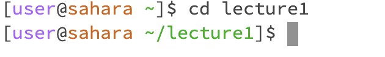

# **Lab Report 1**
***

## Command `cd`
1. Using the Command with no argument
    
   
   * The working directory before entered the command is `/home/lecture1`, after entered the command the working directory is `/home`.
   * The cd command is meant for us to change directory, when the command has no arugment, it will bring us back to home directory from whatever path we are on.
   * The output doesn't have any error occur, the output indicates that the working directory has returned to home directory

2. Using the command with a path to directory as an argument
    
   
   * The Working directory is `/home`, after entered the command the working directory is `/home/lecture1`.
   * The cd command allows us to change the directory, this time we provide a path, which allows us to change our working directory.
   * No error has occurred, we successfully changed our directory to the one we want.

3. Using the command with a path to a filen as an arugment
    
 
  * The Working directory is in message file, `/home`.
  * The cd command is for us to change directory, but this time the path we provide is to a file, thus the command cannot do the thing we want, error message pop up, remind us that the path we entered is not a directory, cd command cannot do anything with the path provided.
  * Error has occur, Error message shows that the path I enter is not a directory. The error occur is becuase the cd command only allow us to change a directory, is for us to move between directorys, but the arugment we enter wants to change to a file instead of a directory, thsu the error message tells us that the path we enter is not a directory.

## Command `ls`
1. Using the command with no arugment
    

   * The Working directory is `/home`
   * The `ls` command will list all the file and folder inside the directory, the output we get is lecture1 the only folder inside the home directory.
   * No eror messages pops up.
   
2. Using the command with a path to directory as an argument
    
   
   * The Working the directory is `/home`
   * The `ls` command will list all the file and floder inside the directory, this time we provide a path to a directory, thus it will list the file and floder in the directory we entered.
   *  No error occur.
   
3. Using the command with a path to file as an argument
    
   
   * The working directory is `/home`
   * The `ls` command will list all the file inside the given directory, when we use the command with a path to a file as an argument we will get a output only listing the path to the file we entered.
   * No error.
     
## Command `cat`
1. Using the command with no argument
    

   * The working directory is `/home`.
   * The output we have acctually is empty, or it repeat what we entered, until we use `Control+D` represent "End Of Signal" to end it.    The `cat` command will print out the content of the file, in this case we didn't specific which file, so it will just wait for our input from the keyboard, then it will repeat the input and print out on the screen.
   * No Error.
2. Using the command with a path to directory as an argument
    
   
   * The working directory is in home direcotry
   * The ouput shows that the path we entered is a direcotry, which is a error message, showing that the command `cat` cannot display the content of a directory, becasue the `cat` command will read the file and give its content as output, we cannot cat a directory.
   * Error messages shows that the path I entered is a directory. The error occur becasue the `cat` command cannot read and display the content of a directroy, it can only read and display content of file as output.
3. Using the command with a path to file as an argument
    
   
   * The working directory is in the messages folder, `/home`.
   * The output is the text in the en-us.txt file, becasue the command `cat` will read the data of a file and give its content as output in your terminal.
   * No error.
