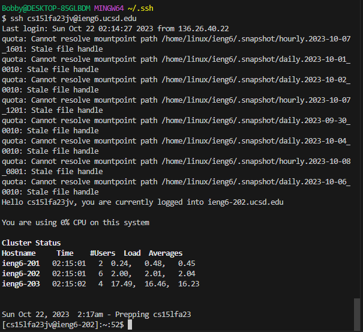

# Lab Reprot 2

## Source Code For `StringServer.java`

```
import java.io.IOException;
import java.net.URI;
import java.net.URLDecoder;

class Handler implements URLHandler {
    // The one bit of state on the server: a number that will be manipulated by
    // various requests.
    int num = 0;
    String str = new String();
    int i = 0;

@Deprecated
public static String decode(String s)
{
    return URLDecoder.decode(s);
}


public String handleRequest(URI url) {
        if (url.getPath().equals("/")) {

        return decode(str);      
        }

        else {
            if (url.getPath().contains("/add")) {
                String[] parameters = url.getQuery().split("=");
                if (parameters[0].equals("s")) {
                    i += 1;
                    str = str + i+"."+parameters[1]+"\n";
                    return decode(str);
                }
            }
            return "404 Not Found!";
        }
    }
}


class StringServer {
    public static void main(String[] args) throws IOException {
        if(args.length == 0){
            System.out.println("Missing port number! Try any number between 1024 to 49151");
            return;
        }

        int port = Integer.parseInt(args[0]);

        Server.start(port, new Handler());
    }
}

```

## Screenshouts of  using `/add-message` 
1. 
 * Once the code is being run, under the `Handler` class, method `handleRequest`, and `decode` has been called and also the `main` method under class `StringServer` is being called.
 * The `main` method takes a array of string as argument, and convert it into interger and store in port inorder for the Server to start. The `decode` method takes String as argument. And the `handleRequest` method takes URI as argument. The value of relevant file of the class are `String str`, and `int i`. `int i` stored 1 as the counter to the string user entered, and `String str` used to store string `Hello` that user entered. 

 * Once the request has been processed, a new string will be stored in `String str` which contains the string requested, and i as the counter. The `int i` value is mean to keep track of how many string has been requested, the valuen of i will change with every `/add` request. If there is no value got changed then it either return to the decode of `String str` (when the path is "/"), or  `return "404 Not Found!"` for path that is unknow. In this case the `int i` stoed `1`, and `String str` stored `1.Hello` .
<br>

2. 
    * This time method `handleRequest` and `decode` has been called.
    * The `decode` method takes String as argument. And the `handleRequest` method takes URI as argument. The value of relevant file of the class are`String str`, and `int i`. The value of `String str` is <br> ```1.Hello
       2.How are you```
    * For this request the `String str` has aleardy strored the `1. Hello`, this time when we use `/add` to add a string, it will concreate with the one aleardy stored in `str`, and also the counter i will be updated and be store in side `str`. If there is no value got changed, either the path is `/`, or is something unknow that return `404 Not Found!`, because if the path is `/add-messages?s=`(has query) even with no arugment, the `i` will also update.
<br>

## SSH Key
1. Private key<br>
2. Public Key<br>
3. NO PASSWORD NEEDED<br>
<br>

## Learning outcomes
* In the lab section of week 2, we learned how to use the `ssh` command to connect to remote server, also we learn how to build and run a Server, and use `path` and `query` to change the output of the webpage. In lab section of week 3, we went deeper into stuff about remote Servers, and SSH keys; The useful tool kit `git for Windows` is something new to me。 The `ssh Keys` is something I never learned before, by using `ssh keygen` we are able to create `public key` and `private key`, these key can be used to log in to Remote Server without letting the user to enter password. We need to use `scp` to copy the public key into the Remote Server in `/.ssh/authorized_keys` folder, where we need to use `mkdir` to create `.ssh` folder in the Remote Server. And the `man` command allows us to see the detail of the command.
