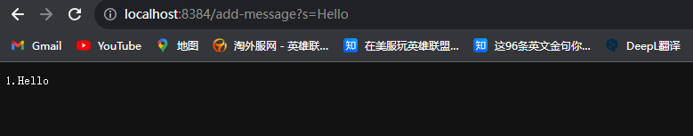

# Lab Reprot 2

## Source Code For `StringServer.java`

```
import java.io.IOException;
import java.net.URI;
import java.net.URLDecoder;
import java.lang.Object;

class Handler implements URLHandler {
    // The one bit of state on the server: a number that will be manipulated by
    // various requests.
    int num = 0;
    String s = new String();
    int i = 0;

@Deprecated
public static String decode(String s)
{
    return URLDecoder.decode(s);
}


public String handleRequest(URI url) {
        if (url.getPath().equals("/")) {

        return decode(s);      
        }

        else {
            if (url.getPath().contains("/add")) {
                String[] parameters = url.getQuery().split("=");
                if (parameters[0].equals("s")) {
                    i += 1;
                    s = s + i+"."+parameters[1]+"\n";
                    return decode(s);
                }
            }
            return "404 Not Found!";
        }
    }
}


class StringServer {
    public static void main(String[] args) throws IOException {
        if(args.length == 0){
            System.out.println("Missing port number! Try any number between 1024 to 49151");
            return;
        }

        int port = Integer.parseInt(args[0]);

        Server.start(port, new Handler());
    }
}

```

## Screenshouts of  using `/add-message` 
1. 
 * Once the code is being runed, method `handleRequest`, and `decode` has been called, where decode has been called at the return.
 * For method `handleRequest` and `decode` the argument is `String str`, that will concatenate the string after `=` to the running string.
 * Once the request has been processed, the `String` value will update to what the user adds, and store it into the String. The `int` value will also update under the method of `handleRequest` evertime user add some message.

2. 
* Once the code is being run, method `handleRequest`, and `decode` is being called, inroder to store string enter by user, and print them to the screen.
* The revelent argument to method `handleRequest` and `decode` is the `String s`
